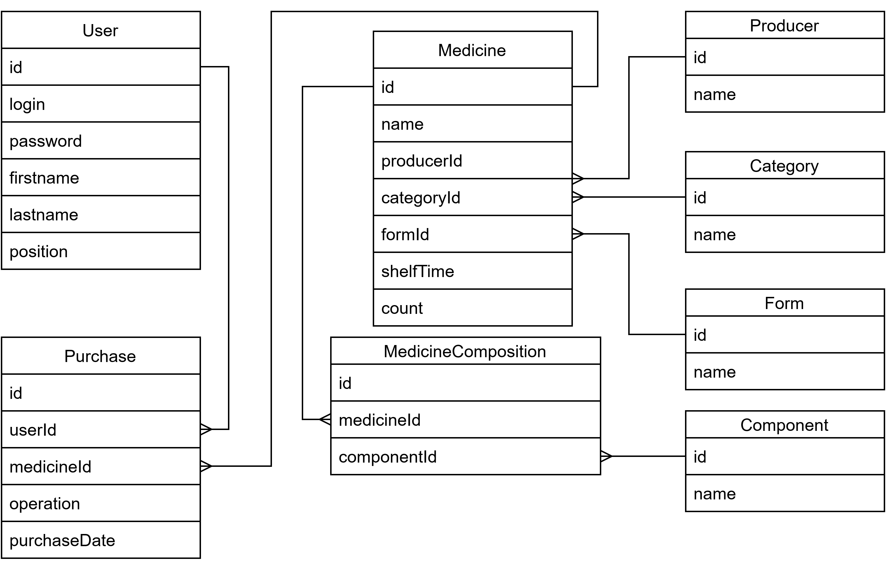

# Внутренний ресурс для фармацевтов аптеки
## Параметры запуска
* Angular + ASP - опция 1 в Startup.cs
* Angular отдельно от ASP - опция 2 в Startup.cs
* https://localhost:44301/
* При необходимости поменять строку подключения ("ConnectionStrings") к БД в файле [appsettings.json](./Farmacy/appsettings.json)
## Функциональность:
1.  Вход с авторизацией по логину-паролю;
1.  Просмотр списка лекарств аптеки с пагинацией;
1.  Возможность фильтрации списка лекарств по нескольким полям;
1.  Пополнение и редактирование списка лекарств;
1.  Параметры лекарств для ввода и редактирования:
    * Название
    * Производитель
    * Тип лекарства из фиксированного набора. Например: витамины, антибиотики, косметика, детские лекарства и т.п.
    * Срок годности
1.  Поиск по полям: Название, производитель
1.  Фильтрация по полю «тип лекарства»

## Модель используемой базы данных:

